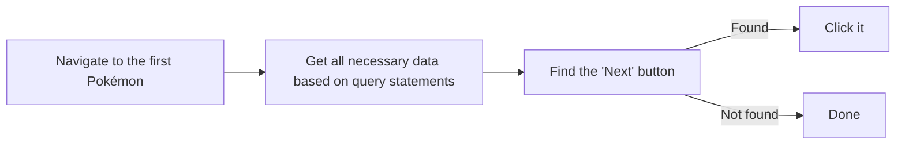

# Cross Site Scripting - Exercize 2

The previous exercize was fun, but now it is time to try out some real things that can happen through CSS.
First `start the docker container` and open [localhost](http://localhost:80/).
Now, the website has long term storage through the use of a database.
So what is the issue with this?
Instead of having a piece of code run once, now a piece of code can be ran everytime the site opens.

1. Make an alert box appear like in the previous exercize, observe what happens when you reload the page.
2. Write `CSS` in the text box and then automatically click the submit button.

What you have done is something that X, previously Twitter, didn't properly deal with.
This caused a clever user to create something that was known as the self-retweeting tweet.
This example applies basically the same concepts.
If you're interested, there is [a video on the subject by Tom Scott](https://www.youtube.com/watch?v=zv0kZKC6GAM).

Another application that applies a similar concept is web-scraping.
By using the structure of a website, information is extracted from the required location.
During an earlier presentation of mine, when I made a working Pokédex app, I scraped all data from the Pokémon website.

